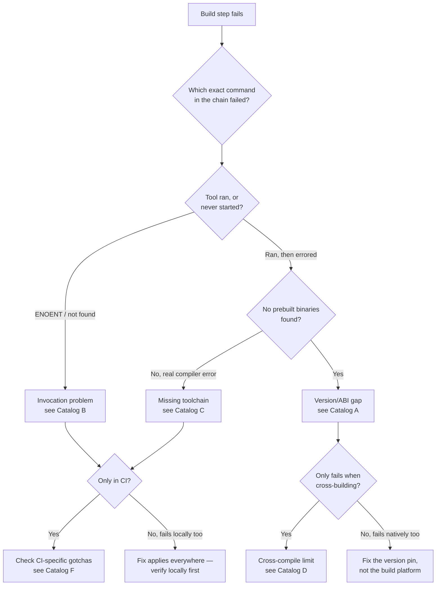

# Diagnosing native-module + Electron packaging failures

A field guide extracted from the Windows packaging incidents in this repo
(see `docs/packaging.md` for the specific fixes). This is the general
method and failure catalog — read it *before* the next native-module
build breaks, not just after.

## Who this is for

Any time a build fails inside: `electron-rebuild`, `node-gyp`,
`prebuild-install`, `electron-builder`, or anything touching a `.node`
file. That combination produces a small, recurring family of bugs. Once
you've seen the family, each new instance takes minutes instead of hours.

## The mental model

A native module isn't portable source — it's a compiled binary. For it to
load, **five independent things have to line up**, and a mismatch in any
one of them looks like a generic crash with no obvious cause:

| Axis | Examples | Where it's declared |
|---|---|---|
| **Platform** | `darwin`, `win32`, `linux` | OS the binary was compiled for |
| **Architecture** | `x64`, `arm64`, `ia32` | CPU the binary was compiled for |
| **Runtime** | `node` vs `electron` | Electron bundles its own Node/V8, not your system Node |
| **ABI number** | Node 20 → 115, Node 22 → 127, Electron 42 → 146, Electron 43 → 148 | Tied to the runtime's major version, looked up via the `node-abi` package |
| **Toolchain** (only if no prebuild exists) | Visual Studio Build Tools + Python (Windows), Xcode CLT (macOS), `build-essential` (Linux) | Whatever `node-gyp` needs to compile from source |

A native module's maintainer publishes prebuilt binaries for *some*
combinations of these axes (check their GitHub releases, not just the npm
page). If the exact combination you need isn't among them, the install
falls through to compiling from source — which only works if the
toolchain for axis 5 is present. **Most failures in this space are one of
these five axes silently not lining up.**

## The method

This is the order that actually finds root causes, not the order that
feels fastest:

1. **Isolate the exact failing command.** A packaging script is usually a
   chain (`build && rebuild && verify && package && restore`). "The build
   failed" is not a diagnosis — which link in the chain, specifically?
   Read the log top to bottom; the last successful line and the first
   error line bracket the real problem.

2. **Read the actual code path before touching anything.** Open the
   script that failed and trace exactly what it invokes and with what
   arguments. Don't reason from what the script is *supposed* to do —
   read what it *actually does*, line by line, on the platform it just
   ran on.

3. **Get raw evidence, not a paraphrase.**
   - Locally: run the exact failing command yourself, with verbose/debug
     flags if the tool supports them (e.g. `DEBUG=electron-rebuild`).
   - In CI: the real step output is the only thing worth trusting.
     GitHub Actions logs need you to be signed in even on public repos —
     if you can't get in, the anonymous Checks API only returns a generic
     `"Process completed with exit code 1"` annotation, which tells you
     *that* it failed and nothing about *why*. Don't write up a root
     cause from that alone; say plainly that you don't have it yet.

4. **Tell apart "the tool never started" from "the tool ran and
   failed."** These need completely different fixes:
   - `ENOENT`, "command not found", path errors → the invocation itself
     is broken (wrong path, missing shim, platform-specific launcher
     issue). The tool's own logic never got a chance to run.
   - A real compiler/linker error, "no prebuilt binaries found", "could
     not find Visual Studio" → the tool started and its actual job
     failed. Now the five-axes mental model above applies.

5. **Verify assumptions against the primary source, not folklore.**
   "Cross-building Windows from Mac needs wine" is folklore — checking
   whether `node-gyp` actually invoked wine (it doesn't) and whether a
   prebuild exists (`curl` the package's GitHub releases API) is the
   primary source. Concretely useful checks:
   ```bash
   # What ABI does this runtime version need?
   node -e "console.log(require('node-abi').getAbi('43.1.1', 'electron'))"

   # What ABIs does this package actually publish prebuilds for?
   curl -s https://api.github.com/repos/<owner>/<repo>/releases/tags/v<version> \
     | grep -oE '(electron|node)-v[0-9]+-[a-z0-9]+-[a-z0-9]+' | sort -u

   # Is a version actually published to npm (a GitHub release/tag isn't enough)?
   npm view <package>@<version> version

   # What kind of binary did we actually produce?
   file path/to/thing.node   # "Mach-O" / "PE32+" / "ELF"
   ```

6. **Fix one variable, re-verify locally before pushing.** If a fix is
   reproducible on your own machine, prove it there first — it's a much
   faster loop than round-tripping through CI.

7. **Then re-test in the real target environment.** A local fix is a
   hypothesis until the actual target (real Windows machine, or CI
   running natively on `windows-latest`) confirms it. Cross-platform bugs
   routinely pass locally and fail on the real target for reasons that
   don't reproduce anywhere else (see the CI-specific failures below).

8. **Expect layered failures.** Fixing one bug commonly reveals the next
   one behind it — a build that used to fail at step 2 of 5 now fails at
   step 4 of 5. That's forward progress, not a failed fix. Don't declare
   victory until the *whole* chain finishes green in the real target
   environment.

## Catalog of failure modes

Every failure in this session (and most you'll hit elsewhere) falls into
one of these buckets:

### A. Version/ABI misalignment
| Symptom | Cause | Confirm | Fix |
|---|---|---|---|
| `No prebuilt binaries found (target=X runtime=Y ... platform=Z)` | The exact runtime version has no published prebuild for this native module | List the package's release assets (command above); compare against the ABI your runtime needs | Pin the runtime to a version the package *does* publish for, or wait for/use a newer package release |
| Same message, but for `runtime=node` instead of `electron` | A *plain Node* rebuild step (not Electron) hit the same gap for the CI runner's Node version | Same check, with `runtime=node` | Same options — or skip the step entirely if it's not actually needed in that environment |
| Falls to `node-gyp rebuild` and then a real compiler error | No prebuild exists for either axis above, and now the toolchain itself is the constraint | Read the actual `node-gyp` error text | Fix the missing toolchain (see below), or avoid needing a from-source compile at all by realigning versions |

### B. Invocation / tooling failures
| Symptom | Cause | Confirm | Fix |
|---|---|---|---|
| `ENOENT` on a `node_modules/.bin/<tool>` path, only on Windows | That `.bin` entry is a symlink to a shebang script; Windows can't execute shebangs directly | `ls -la node_modules/.bin/<tool>` on macOS/Linux — it's a symlink to a `.js` file | Resolve the package's real JS entry point (its `package.json` `bin` field) and invoke it via `execFileSync(process.execPath, [entryPath, ...args])` instead of the `.bin` path |
| "command not found" only in CI | Tool installed in a different working directory than the one the step runs from, or an npm script assumes a cwd it doesn't have in CI | Check the workflow's `working-directory:` against where `npm install` actually ran | Align cwd, or use absolute/resolved paths instead of assuming a shell's cwd |

### C. Missing compiler toolchain (only matters once you're forced to compile from source)
| Platform | What's needed | Symptom when missing |
|---|---|---|
| Windows | Visual Studio Build Tools ("Desktop development with C++") + Python | `gyp ERR! find VS ... could not find a version of Visual Studio 2017 or newer to use` — note this can also fire on a machine that *has* VS installed, if `node-gyp` doesn't recognize a very new VS version/edition string |
| macOS | Xcode Command Line Tools | `xcrun: error: invalid active developer path` |
| Linux | `build-essential`, Python | `gyp: No Xcode or CLT version detected` (misleading message reused across platforms) / missing `gcc`/`make` |

### D. Cross-compilation is not generally possible
`node-gyp` refuses to compile a native module for a platform other than
the one it's running on — there is no cross-compiler fallback. Building
platform X's installer only reliably works either (a) natively on
platform X, or (b) if a prebuilt binary for X already exists so no
compile is needed at all. Don't assume "it worked once" from a cross-build
means the binary is actually correct — check `file` on the result.

### E. Packaging/bundling mechanics (Electron-specific)
| Symptom | Cause | Confirm | Fix |
|---|---|---|---|
| Installed app crashes with "not a valid Win32 application" / `ERR_DLOPEN_FAILED`, but the build "succeeded" | A native module was rebuilt for the wrong platform, then copied byte-for-byte into every package target | `file` the `.node` file inside the actual packaged app, not just the source tree | Make the rebuild step take an explicit target platform/arch — never let it default silently to the host |
| A bundler's "automatic native rebuild" doesn't seem to do anything | Bundlers (e.g. electron-builder) usually only rebuild the *app's own* dependency tree, not dependencies bundled in some other way (e.g. `extraResources` copying a sibling directory's `node_modules`) | Trace the bundler's own rebuild-scope logic/docs, or just check whether the copied binary's platform actually changed after a rebuild | Rebuild explicitly yourself before packaging; don't rely on the bundler's automatic pass to cover non-standard bundling |
| A shared `node_modules` gets left in the wrong ABI for local dev after a packaging run | The same folder is rebuilt in-place for the packaged target, and dev usually needs the host's plain-Node ABI | Try `npm run dev` right after a packaging run | Restore the host ABI (e.g. `npm rebuild <module>`) after packaging — but see below for doing this only where it's needed |

### F. CI-environment-specific gotchas
| Symptom | Cause | Confirm | Fix |
|---|---|---|---|
| A step fails in CI that has no real purpose there (e.g. restoring local dev state) | The step was written for a persistent developer machine, not a disposable CI runner | Ask: does this step's result outlive the job? If the runner is destroyed right after, it doesn't matter | Skip it conditionally (CI sets `process.env.CI` automatically) rather than trying to make it succeed somewhere it doesn't need to run |
| Re-running a failed run doesn't pick up a just-pushed fix | "Re-run failed jobs" replays the *original* commit SHA, it does not fetch the branch's latest commit | Check the run's `head_sha` against your latest push | Start a genuinely new run (`workflow_dispatch` → pick the branch again), don't just re-run the old one |
| One matrix leg shows "cancelled," looks like a second bug | Default `fail-fast: true` cancels sibling matrix jobs when one fails — this is expected, not a separate failure | Check the job's conclusion field — `cancelled` ≠ `failure` | Nothing to fix unless you want independent legs, in which case set `fail-fast: false` |
| Can't read the actual failing step's log | Public repos can still gate raw Action logs behind sign-in; anonymous API log-download endpoints return 403 "must have admin rights" | Try the run in a browser while signed out, and the `/actions/jobs/{id}/logs` API unauthenticated | Ask whoever has repo access to paste the log, or view it yourself once signed in — don't guess the content |

### G. Registry/publishing gaps
A GitHub release/tag existing is not the same as the package being
published to npm. A maintainer can cut a release with the exact prebuild
you need and not have pushed it to the npm registry yet.
`npm view <pkg>@<version> version` returning 404 while the GitHub release
clearly exists is the tell — don't assume bumping a semver range will
work without checking this first.

## Quick triage



## This repo's case study

Four distinct, layered bugs, found across four separate CI/local runs —
a realistic example of "expect layered failures" above:

1. **Packaging mechanics** (Catalog E): `rebuild-native.js` defaulted to
   the host platform, so a Windows installer silently shipped a
   macOS-compiled binary. Fixed by making the target platform explicit.
2. **Version/ABI misalignment** (Catalog A): once the target was forced
   to genuinely be `win32`, no prebuild existed for the pinned Electron
   version's ABI (148) in the pinned `better-sqlite3` release (max 146).
   Fixed by pinning Electron to a version within the covered ABI range.
3. **Invocation failure** (Catalog B): the rebuild script executed
   `node_modules/.bin/electron-rebuild` directly — a symlink-to-shebang
   that only macOS/Linux can run. Fixed by invoking the package's real
   `.js` entry point via `node` explicitly.
4. **CI-environment gotcha** (Catalog F): the trailing "restore dev ABI"
   step failed in CI for a *fourth*, unrelated version gap (Node 20 had no
   prebuild either), but that step never needed to run in CI at all.
   Fixed by skipping it when `process.env.CI` is set.

Each fix was verified locally where possible, then confirmed (or not) by
a fresh CI run — never assumed from a locally-looking-plausible change.
Full details and the actual evidence for each step: `docs/packaging.md`.
